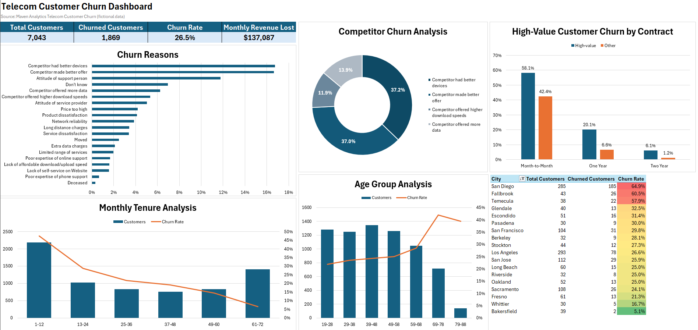

# Telecom Customer Churn Analysis (Excel)

**Tools:** Excel (Tables, PivotTables, PivotCharts, conditional formatting)

## Problem

A telecom company is losing customers. Why are they leaving, are the most valuable customers among them, and what should the company do about it?

## Data

Maven Analytics "Telecom Customer Churn": 7,043 customers of a fictional California telecom, one row per customer, with demographics, services, charges, contract type and churn reasons. Source and license are listed at the bottom.

## Method

- Checked for duplicates (none) and missing values. Filled blank service fields with "No Phone Service", "No Internet" and "Not churned" so they can be grouped.
- Added a `Churned` flag and a `High Value` flag (top 25% of customers by monthly charge, $89.75 or more).
- Built PivotTables and PivotCharts for churn reasons, contract, tenure, age, internet type, city and high-value customers, then combined them into a one-page dashboard.

## Key findings

1. **Churn is costly:** 26.5% of customers (1,869 of 7,043) churned, costing $137,087 in monthly revenue, about $1.65M a year.
2. **High-value customers are at risk:** they churn at 33.0% vs 24.4% for other customers, and on month-to-month contracts at 58.1% vs 42.4%.
3. **Contract and timing matter:** month-to-month customers churn at 45.8% vs 2.5% on two-year contracts, and 55.5% of churners leave in their first year.
4. **Competitors drive churn:** 45.0% of churners left for a competitor, mainly for better devices (16.7%) and better offers (16.6%).

The full findings and recommendations are in the `Insights` tab of the workbook.

## Extra question: why is San Diego so high?

San Diego churns at 64.9% (185 of 285 customers) vs 26.5% overall. 78.9% of its churners cite a competitor's better offer, which suggests a local competitor promotion worth investigating.

## Recommendation

Offer high-value month-to-month customers an incentive to move to a one-year contract (their churn is 58.1% vs 20.1% on one-year), and run a targeted counter-offer in San Diego. Two more recommendations, a first-year retention program and a review of fiber devices and speeds, are in the `Insights` tab.

## Limitations

This is a single fictional snapshot with no cost data, so no return on investment is estimated. The findings show associations, not proof of cause. The 454 customers who recently joined are counted as not churned.

**Next analysis ideas:** the effect of offers and tech support on churn, a churn prediction model in Python, and A/B tests of the recommendations.

## Files

- `telecom-churn-analysis.xlsx`: the workbook, with Overview (dashboard), Insights, Customers and Analysis tabs
- `images/`: dashboard screenshot
- `data/`: the original CSV and data dictionary from Maven Analytics. The zip-code population file was not used, because most zip codes have too few customers for reliable rates.

## Data source

Maven Analytics, [Telecom Customer Churn](https://mavenanalytics.io/data-playground/telecom-customer-churn). Maven lists the dataset as public domain and credits IBM Cognos Analytics as the original source. The data is fictional.
